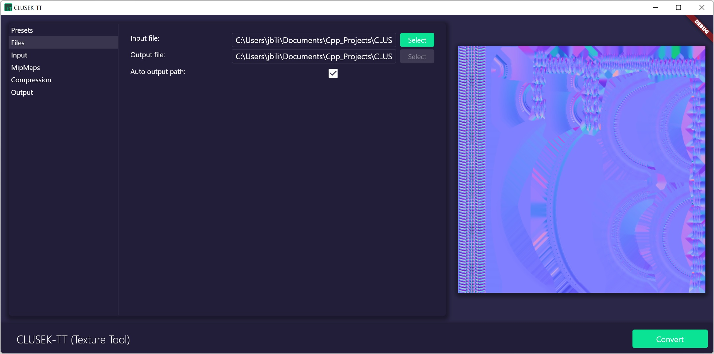

CLUSEK-TT
==================================

**CLUSEK-TT** *(Texture Tool)* is a small tool designed for fast and easy texture compression, that can be used in the [CLUSEK-RT](https://github.com/bilek993/CLUSEK-RT) game engine. With this utility, developers can convert any image into [Block Compressed](https://www.reedbeta.com/blog/understanding-bcn-texture-compression-formats/) textures in [DDS](https://docs.microsoft.com/en-us/windows/win32/direct3ddds/dx-graphics-dds) format. This tool can be run only on Windows due to [DirectXTex](https://github.com/microsoft/DirectXTex) restrictions.

## Requirements

To be able to build from source, you need to have:

- Flutter 2.10.5
- Visual Studio 2019 with C++ compiler
- Windows OS

## Binary download

 The latest official version of this tool can be downloaded from [here](https://github.com/bilek993/CLUSEK-TT/releases/latest/).

## Author

This application is developed single-handed by Jakub Biliński. You can find out more about me on my website: [jbilinski.pl](http:/www.jbilinski.pl).